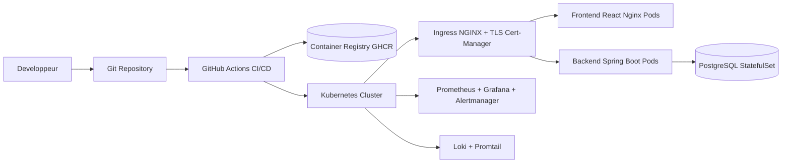

# Plateforme DevOps - Spring Boot + React

## Architecture cible



## Arborescence livree

- devops/k8s/base
- devops/k8s/overlays/dev
- devops/k8s/overlays/staging
- devops/k8s/overlays/prod
- devops/helm/agence-platform
- devops/observability
- .github/workflows/ci-cd.yml

## Docker local

```bash
docker compose up -d --build
docker compose ps
```

Services attendus:
- Frontend: http://app192.168.56.8
- Backend: http://api192.168.56.8
- PostgreSQL: localhost:5432
- pgAdmin: http://localhost:8082

## Kubernetes avec Kustomize

```bash
kubectl apply -f devops/k8s/base/namespaces.yaml
kubectl apply -k devops/k8s/overlays/dev
kubectl apply -k devops/k8s/overlays/staging
kubectl apply -k devops/k8s/overlays/prod
```

## Helm

```bash
helm upgrade --install agence-platform ./devops/helm/agence-platform \
  --namespace agence-dev --create-namespace \
  -f devops/helm/agence-platform/values.yaml \
  -f devops/helm/agence-platform/values-dev.yaml
```

Staging:

```bash
helm upgrade --install agence-platform ./devops/helm/agence-platform \
  --namespace agence-staging --create-namespace \
  -f devops/helm/agence-platform/values.yaml \
  -f devops/helm/agence-platform/values-staging.yaml
```

Production:

```bash
helm upgrade --install agence-platform ./devops/helm/agence-platform \
  --namespace agence-prod --create-namespace \
  -f devops/helm/agence-platform/values.yaml \
  -f devops/helm/agence-platform/values-prod.yaml
```

## CI/CD

Workflow: .github/workflows/ci-cd.yml

Pipeline:
1. Checkout
2. Cache Maven + Node
3. Compile backend
4. Tests backend
5. Build frontend
6. Tests frontend
7. SonarQube
8. Trivy fs + images
9. Build images
10. Push GHCR
11. Deploy auto par branche

Mapping des branches:
- develop -> dev
- staging -> staging
- main -> prod (via environnement GitHub production avec approbation manuelle)

Secrets GitHub requis:
- SONAR_TOKEN
- SONAR_HOST_URL
- KUBECONFIG_DEV (base64)
- KUBECONFIG_STAGING (base64)
- KUBECONFIG_PROD (base64)

## Zero Downtime

Mecanismes en place:
- RollingUpdate avec maxUnavailable: 0 et maxSurge: 1
- Probes startup/readiness/liveness
- HPA backend
- Deploy helm --wait

## Rollback

Helm rollback:

```bash
helm history agence-platform -n agence-prod
helm rollback agence-platform <REVISION> -n agence-prod
```

Kubernetes rollout rollback:

```bash
kubectl rollout history deployment/agence-platform-backend -n agence-prod
kubectl rollout undo deployment/agence-platform-backend -n agence-prod
```

## Securite

Controles inclus:
- Secrets Kubernetes
- TLS via cert-manager + ingress
- Containers non-root
- SecurityContext sans escalation
- Drop de toutes les capabilities Linux
- NetworkPolicy par defaut deny
- ResourceQuota namespace
- RBAC minimal pour service account
- Trivy dans CI

## Blue/Green ou Canary

Option recommandee:
- Utiliser Argo Rollouts pour canary progressif
- Alternative simple: deux releases Helm (agence-blue/agence-green) et bascule Ingress

## Monitoring et Logs

Details d installation dans devops/observability/README.md
