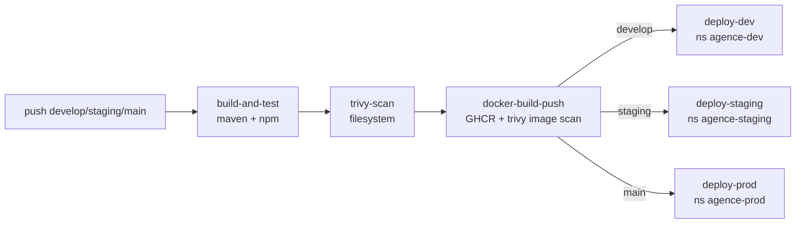

# DevOps – déploiement Kubernetes local & CI/CD

Ce dossier centralise toute la configuration de déploiement du projet (backend
Spring Boot, frontend React/Vite, PostgreSQL) : un cluster **local** (`kind`)
exposé sur `http://localhost` pour le développement, et le même chart Helm
réutilisé par la CI/CD GitHub Actions pour les environnements dev/staging/prod
distants. Pas de cert-manager : tout est en HTTP (TLS géré en amont en
staging/prod si besoin).

```
devops/
  k8s/
    kind-cluster.yaml        # cluster kind avec port 80/443 mappés sur l'hôte
    base/                    # manifests bruts, un fichier par Kind
      namespace.yaml
      postgres/  (configmap, secret, pvc, deployment, service)
      backend/   (configmap, secret, deployment, service)
      frontend/  (deployment, service)
      ingress.yaml
    overlays/local/          # overlay kustomize pointant vers les images :local
  helm/agence/               # chart Helm (local ET utilisé par la CI/CD)
    values.yaml              # defaults (usage local)
    values-dev.yaml           # surcharges déployées par le job deploy-dev
    values-staging.yaml       # surcharges déployées par le job deploy-staging
    values-prod.yaml          # surcharges déployées par le job deploy-prod
```

Les valeurs (DB, JWT, CORS, ports) reprennent celles de `.env.dev` à la racine
du repo. Les secrets déclarés ici sont des valeurs de dev déjà publiques dans
`.env.dev` — à ne jamais réutiliser telles quelles en production.

## 1. Créer le cluster local

```powershell
kind create cluster --config devops/k8s/kind-cluster.yaml
kubectl apply -f https://raw.githubusercontent.com/kubernetes/ingress-nginx/controller-v1.11.3/deploy/static/provider/kind/deploy.yaml
kubectl wait --namespace ingress-nginx --for=condition=ready pod --selector=app.kubernetes.io/component=controller --timeout=120s
```

## 2. Construire et charger les images

```powershell
docker build -t agence-backend:local ./backend
docker build -t agence-frontend:local --build-arg VITE_API_BASE_URL=http://localhost:8090/api/v1 ./frontend
kind load docker-image agence-backend:local --name agence-local
kind load docker-image agence-frontend:local --name agence-local
```

## 3a. Déployer avec Kustomize (kubectl natif)

```powershell
kubectl apply -k devops/k8s/overlays/local
kubectl -n agence rollout status deployment/backend
kubectl -n agence rollout status deployment/frontend
```

## 3b. Déployer avec Helm (local)

```powershell
helm upgrade --install agence devops/helm/agence --namespace agence --create-namespace
helm status agence -n agence
```

### Vérifier que Helm fonctionne

```powershell
helm version                       # CLI installée
helm list -n agence                # STATUS doit être "deployed"
helm status agence -n agence       # détail des ressources + NOTES
helm get values agence -n agence   # valeurs effectivement appliquées
```
Si `STATUS` n'est pas `deployed` (ex: `pending-install`, `failed`), inspecter
avec `kubectl -n agence get pods` puis `kubectl -n agence describe pod <nom>`.

## 4. Accéder à l'application

Ouvrir `http://localhost:8090/` (frontend) — les appels API passent par
`http://localhost:8090/api/...` via l'Ingress vers le service `backend`.
(Le port 8090 est utilisé au lieu de 80 car ce dernier est réservé par
Windows/http.sys sur cette machine.)

## Nettoyage

```powershell
kubectl delete -k devops/k8s/overlays/local   # ou: helm uninstall agence -n agence
kind delete cluster --name agence-local
```

## CI/CD GitHub Actions

Le pipeline [.github/workflows/ci-cd.yml](../.github/workflows/ci-cd.yml)
utilise ce chart Helm (`devops/helm/agence`) pour déployer automatiquement sur
de vrais clusters distants (pas le cluster `kind` local) :



- **Images** : construites et poussées sur `ghcr.io/<owner>/agence-backend`
  et `agence-frontend`, taguées `sha-<commit>` + `dev-latest`/`staging-latest`/
  `prod-latest` selon la branche.
- **Déploiement** : `helm upgrade --install agence ./devops/helm/agence -f
  devops/helm/agence/values-<env>.yaml --set backend.image.tag=...` dans le
  namespace `agence-<env>` du cluster ciblé par le kubeconfig du secret.
- **Values par environnement** : [values-dev.yaml](helm/agence/values-dev.yaml),
  [values-staging.yaml](helm/agence/values-staging.yaml),
  [values-prod.yaml](helm/agence/values-prod.yaml) (host, CORS, profils Spring,
  ressources). `values-prod.yaml` définit un `apiHost` séparé (API et
  frontend sur des domaines distincts, comme dans `.env.prod`).

### Secrets GitHub requis (Settings → Secrets and variables → Actions)

| Secret                       | Usage                                              |
|-------------------------------|-----------------------------------------------------|
| `KUBECONFIG_DEV`              | kubeconfig (base64) du cluster dev                  |
| `KUBECONFIG_STAGING`          | kubeconfig (base64) du cluster staging              |
| `KUBECONFIG_PROD`             | kubeconfig (base64) du cluster prod                 |
| `POSTGRES_PASSWORD_DEV/STAGING/PROD` | mot de passe PostgreSQL de l'environnement   |
| `JWT_SECRET_DEV/STAGING/PROD` | secret JWT de l'environnement                       |
| `SONAR_TOKEN`, `SONAR_HOST_URL` | optionnels, analyse SonarQube                      |

`GITHUB_TOKEN` (fourni automatiquement) sert à pousser les images sur GHCR.
Sans ces secrets, les jobs `deploy-*` échouent mais `build-and-test`,
`trivy-scan` et `docker-build-push` continuent de fonctionner sur chaque PR.

### Tester la config Helm/CI localement sans cluster distant

```powershell
helm lint devops/helm/agence -f devops/helm/agence/values-dev.yaml
helm template agence devops/helm/agence -f devops/helm/agence/values-staging.yaml --namespace agence-staging
```

